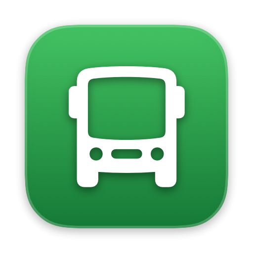
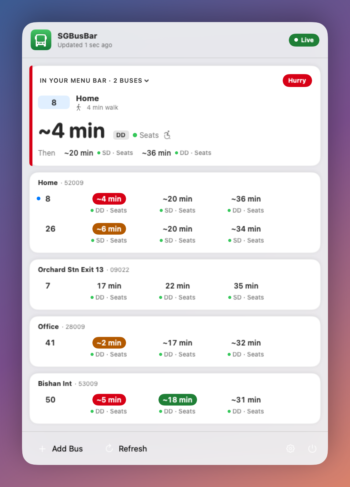
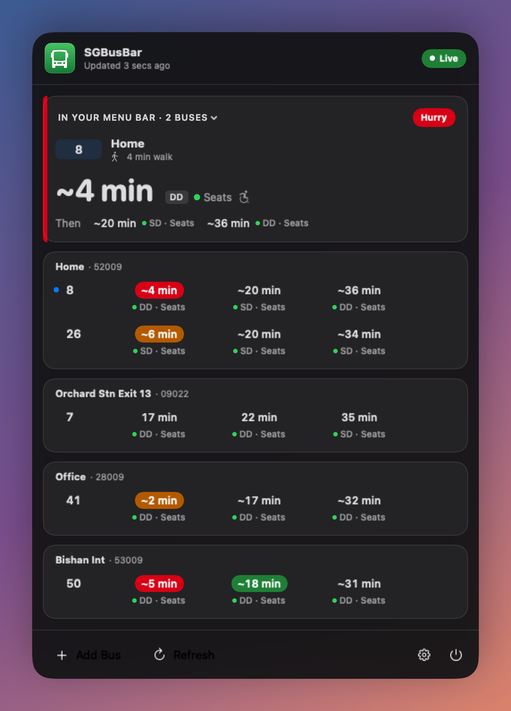
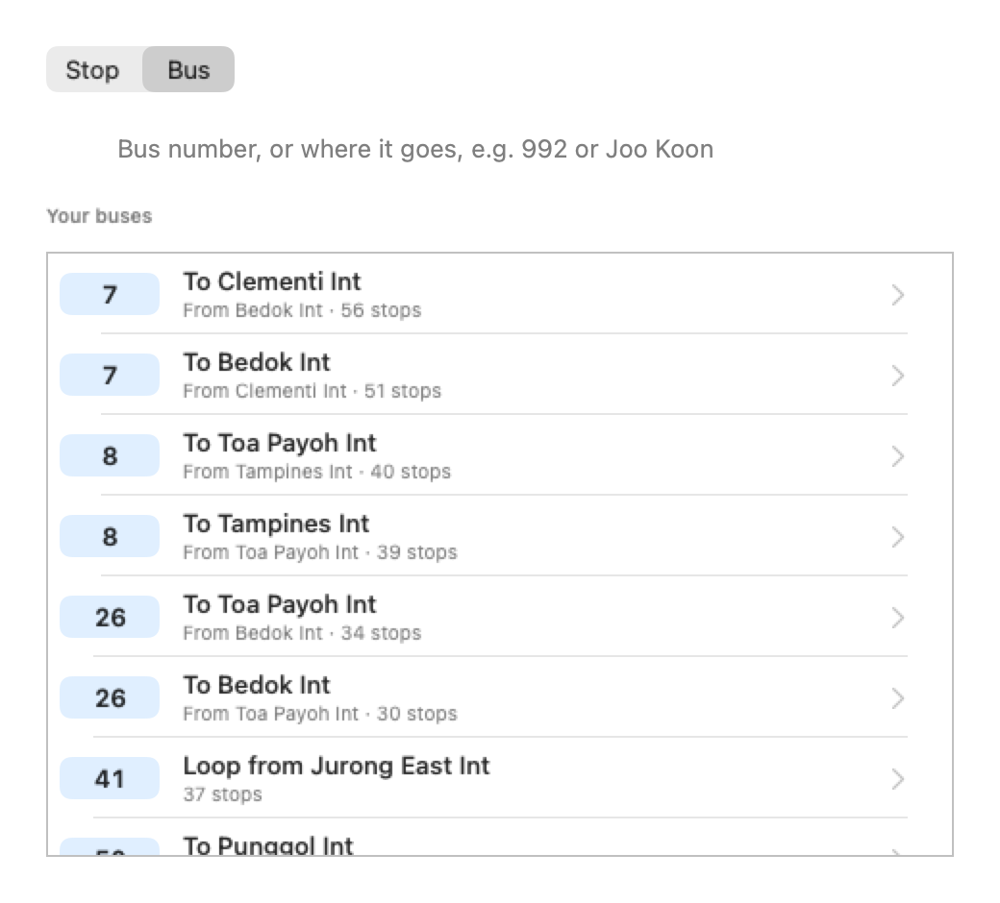
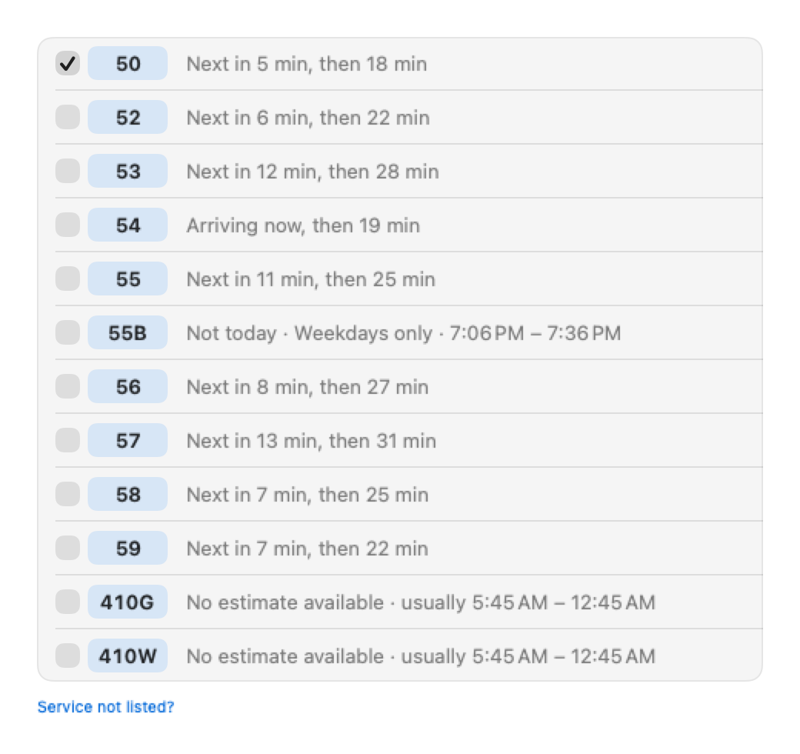

<p align="center">
  
</p>

<h1 align="center">SGBusBar</h1>

<p align="center">
  Singapore bus arrivals in your Mac's menu bar, coloured by when you need to leave.
</p>

<p align="center">
  <a href="https://github.com/syazfraser/SGBusBar/actions/workflows/ci.yml"></a>
  <a href="https://github.com/syazfraser/SGBusBar/releases/latest"></a>
  
  
  <a href="LICENSE"></a>
</p>

<p align="center">
  
  
</p>

## Features

- **Your next bus in the menu bar.** Show none, 1, 2 or 3 arrival times for the bus you pick, e.g. `992  3m · 11m`.
- **Colours that answer "can I still make it?"** Times are coloured by the minutes you have to spare after walking to the stop: red to hurry, orange to leave now, green to leave soon.
- **Every bus you care about, at a glance.** The popup shows the next 3 arrivals for each bus, and each one's own type (single deck, double deck, bendy) and how full it is.
- **Add a bus without knowing the stop.** Search for a stop by name, road or code, or search for your bus and pick the stop from its route. Every service at a stop is listed, running now or not, so there's nothing to type.
- **Name stops your way.** Keep LTA's stop name or use a nickname like "Home" or "Office", and set one walk time per stop.
- **Looks at home on macOS 26.** Liquid Glass throughout, with a Light, Dark or System theme and a Frosted or Clear glass popup.
- **Light on LTA's servers and your battery.** One request per stop, never faster than LTA's own 20-second update, nothing while your Mac sleeps, and stops with no buses scheduled are skipped.

<p align="center">
  
  
</p>

## Install

### Homebrew

```bash
brew install --cask syazfraser/tap/sgbusbar
```

Update later with `brew upgrade --cask sgbusbar`.

### Download

Get the latest `SGBusBar-x.y.z.zip` from [Releases](https://github.com/syazfraser/SGBusBar/releases/latest), unzip it and drag **SGBusBar** to Applications.

### First launch

SGBusBar isn't notarised by Apple yet, so macOS may block it the first time. Open **System Settings > Privacy & Security**, scroll down to the message about SGBusBar and click **Open Anyway**. You only need to do this once.

### Build from source

You need Xcode 26 (free from the Mac App Store).

```bash
git clone https://github.com/syazfraser/SGBusBar.git
cd SGBusBar
./install.sh
```

`install.sh` builds a Release copy, puts it in Applications and opens it. Run it again after `git pull` to update.

## Setting up

1. Get a free API key from [LTA DataMall](https://datamall.lta.gov.sg/content/datamall/en/request-for-api.html). It arrives by email.
2. Click the bus icon in the menu bar and paste the key. SGBusBar checks it with LTA and keeps it in your Keychain.
3. Click **Add Bus**, find your stop or your bus, and tick the services you catch.
4. Optional: turn on **Settings > General > Launch at Login**.

## How the colours work

Minutes to spare = minutes until the bus minus your walk to the stop.

| Colour | Minutes to spare | Meaning |
| --- | --- | --- |
| Red | Under 1, or "Arr" | Hurry: you'll miss it unless you're at the stop |
| Orange | 1–4 | Leave now |
| Green | 5–14 | Leave soon |
| No colour | 15 or more | No rush |

A "~" means the time is LTA's scheduled estimate rather than the bus's live position.

## Compatibility

| | |
| --- | --- |
| macOS | 14 Sonoma or later. Liquid Glass on macOS 26 Tahoe; standard materials on 14 and 15 |
| Macs | Apple silicon and Intel (universal build) |
| Built with | Xcode 26.6, Swift 6.3, SwiftUI and AppKit |
| Tested on | macOS 26.5 (CI runs on macOS 26) |

## Project structure

| Part | Files |
| --- | --- |
| Menu bar item and popup | `StatusItemController`, `DropdownView`, `ArrivalViews`, `PopupStyle` |
| Settings, Add Bus, Edit Stop | `SettingsView`, `SettingsComponents`, `AddBusWizard`, `StopEditor`, `BusFormParts` |
| Data and LTA | `ArrivalStore` (buses, settings, polling), `BusStopDirectory` (stop and route lists), `LTAClient` |
| System | `Keychain`, `LoginItem`, `Glass` (Liquid Glass with fallbacks), `AppIcon`, `Changelog` |
| Tests | `SGBusBarTests/` (Swift Testing) |

It uses three LTA DataMall APIs: **BusArrival v3** for live times, and **BusStops** and **BusRoutes** for stop names, the services at each stop and each route's stops in order. The lists are cached on your Mac and refreshed weekly.

## Development

```bash
open SGBusBar.xcodeproj          # then ⌘R to run, ⌘U to test
```

Or from the command line:

```bash
xcodebuild test -project SGBusBar.xcodeproj -scheme SGBusBar -destination 'platform=macOS'
```

Every push and pull request runs the tests and a Release build on GitHub Actions. Tagging a version builds the app and publishes it as a GitHub Release; see [RELEASING.md](docs/RELEASING.md).

## Contributing

Bug reports, ideas and pull requests are welcome. Please read [CONTRIBUTING.md](CONTRIBUTING.md) first, and note the [Code of Conduct](CODE_OF_CONDUCT.md).

## Privacy

SGBusBar has no account, analytics or tracking. Your buses and settings stay on your Mac, and your API key is kept in your Keychain and sent only to LTA DataMall.

## Acknowledgements

Bus data comes from [LTA DataMall](https://datamall.lta.gov.sg), Singapore's Land Transport Authority. SGBusBar isn't affiliated with or endorsed by LTA, and arrival times are LTA's estimates.

## Licence

[MIT](LICENSE) © 2026 syazfraser
